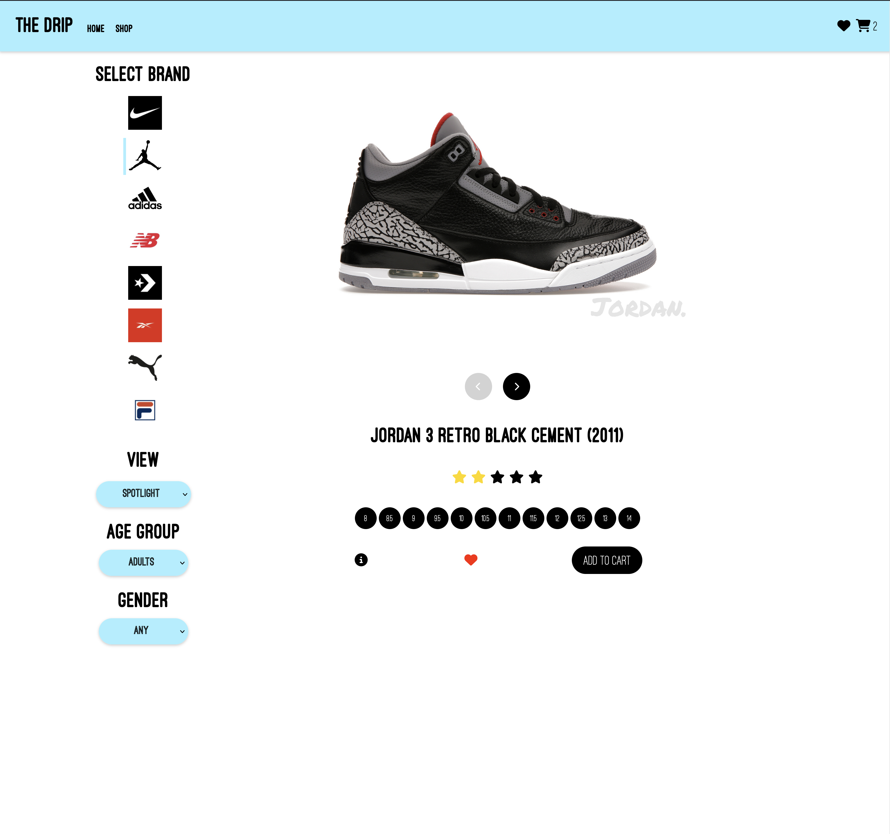
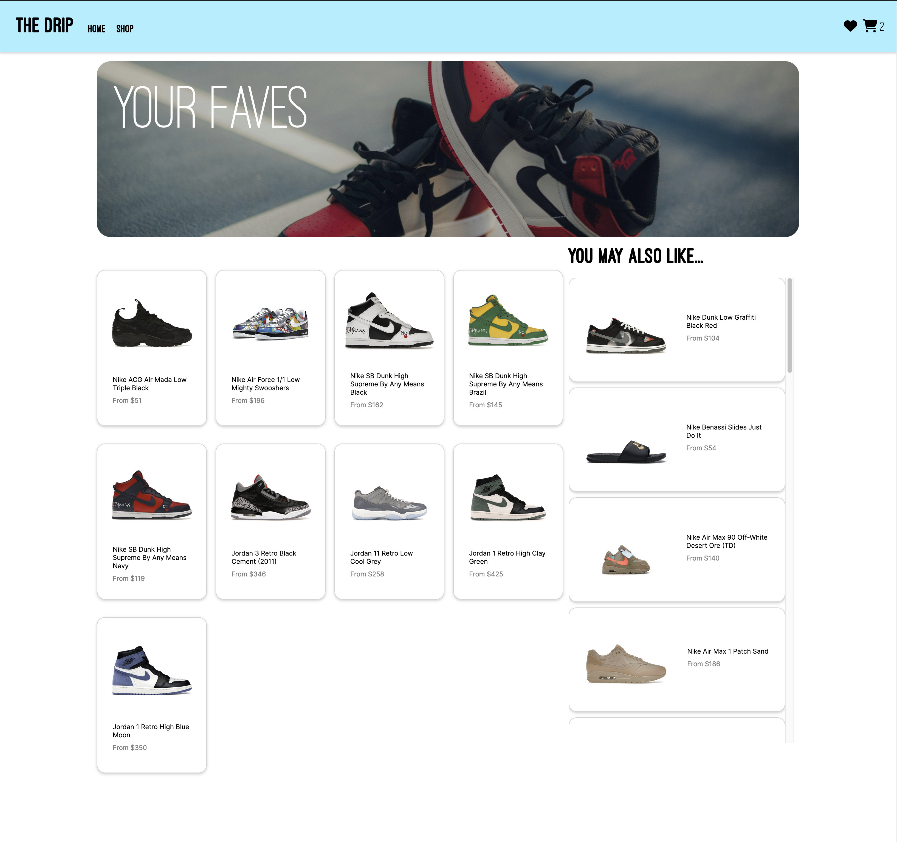
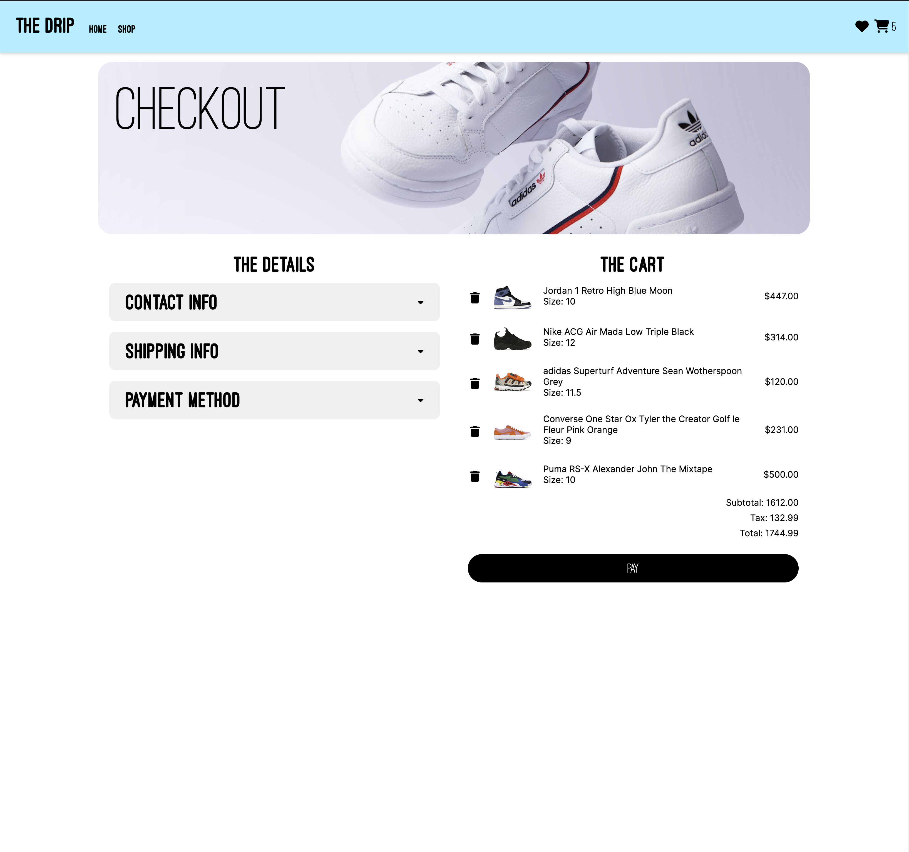
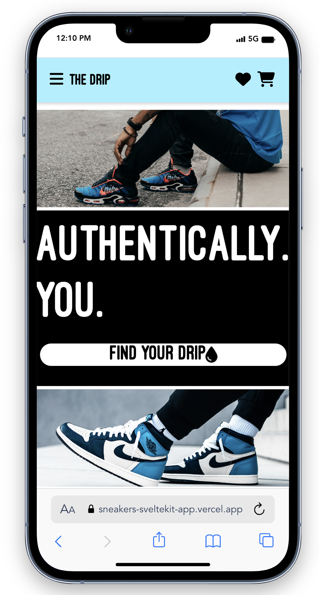
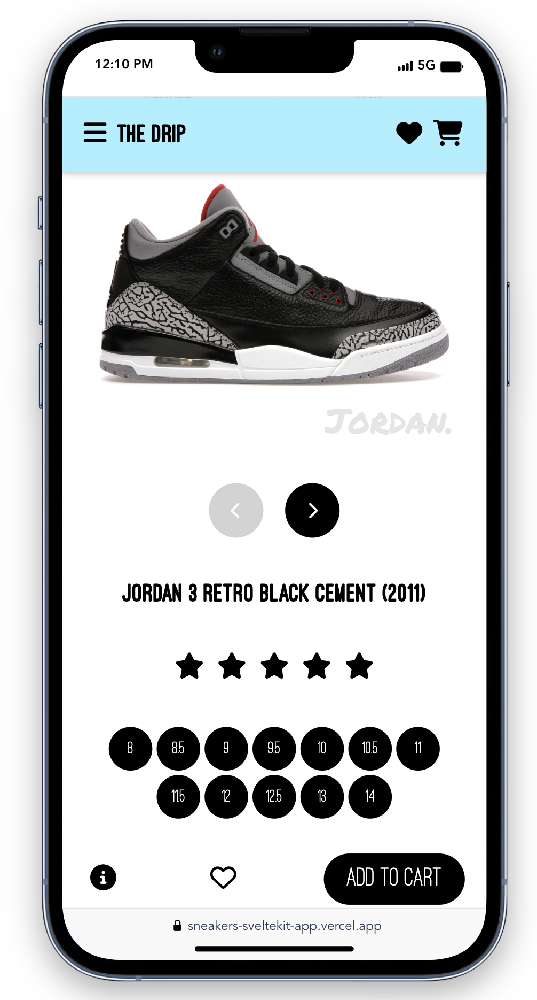
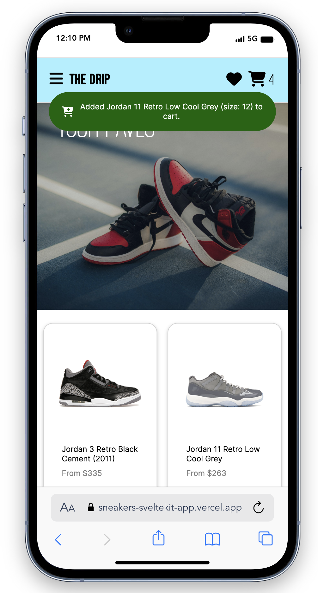
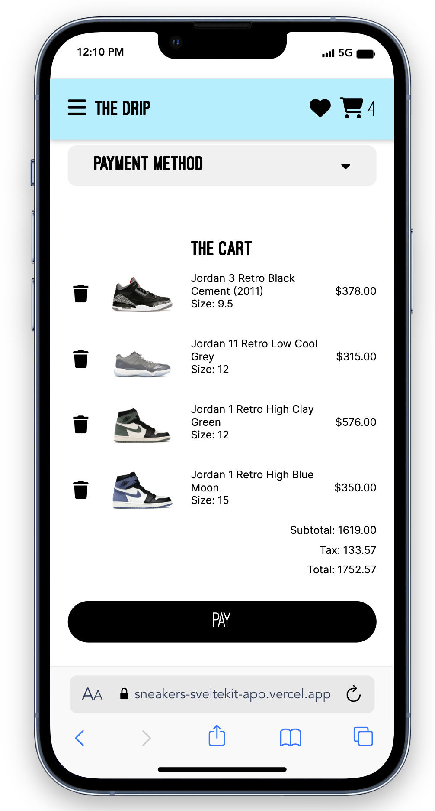

# Sneakers Ecommerce Store

A side project to build an ecommerce store using Sveltekit, Typescript, and CSS.


## Demo

https://sneakers-sveltekit-app.vercel.app/


## Screenshots











## Run Locally

Clone the project

```bash
  git clone https://github.com/marc-marquez/sneakers-sveltekit-app.git
```

Go to the project directory

```bash
  cd sneakers-sveltekit-app
```

Install dependencies

```bash
  npm install
```

Start the server

```bash
  npm run start
```


## Authors

- [@marc-marquez](https://www.github.com/marc-marquez)


## Acknowledgements

 - [StockX API](https://stockx.vlour.me/)
 - [Design Inspiration](https://dribbble.com/search/Shoe-store)

